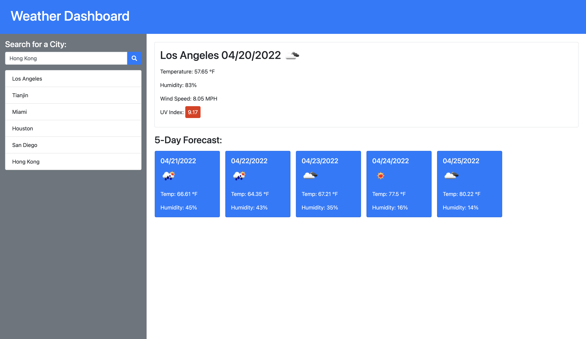

# Weather Dashboard

 

## Description

A HTML, CSS and JavaScript based web application to show 5-day eather forecast of searched cities.

## Table of Contents

- [Installation](#Installation)
- [Usage](#Usage)
- [DeployedLink](#DeployedLink)
- [License](#License)

- [Questions](#Questions)

## Installation

To install the necessary dependencies, run the following command: 
<code>run index.html</code>

## Usage

## DeployedLink

https://king23wl.github.io/Weather-Dashboard/

## License

## Questions

For more information, please contact me:  

Email: xuanan.ian23y@gmail.com  
  GitHub: [King23WL](https://github.com/King23WL)
